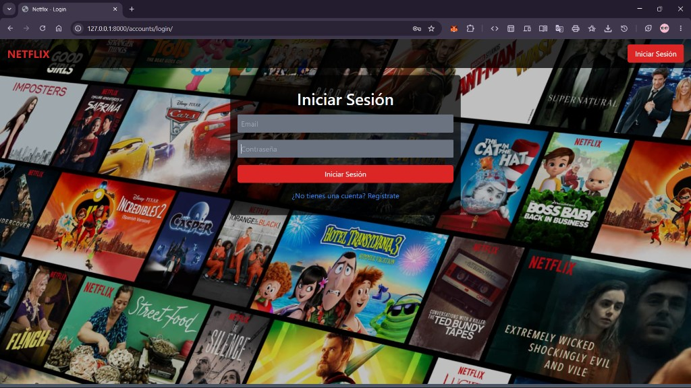
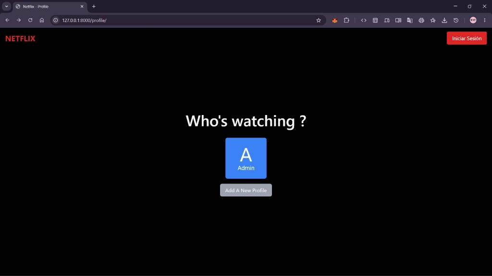
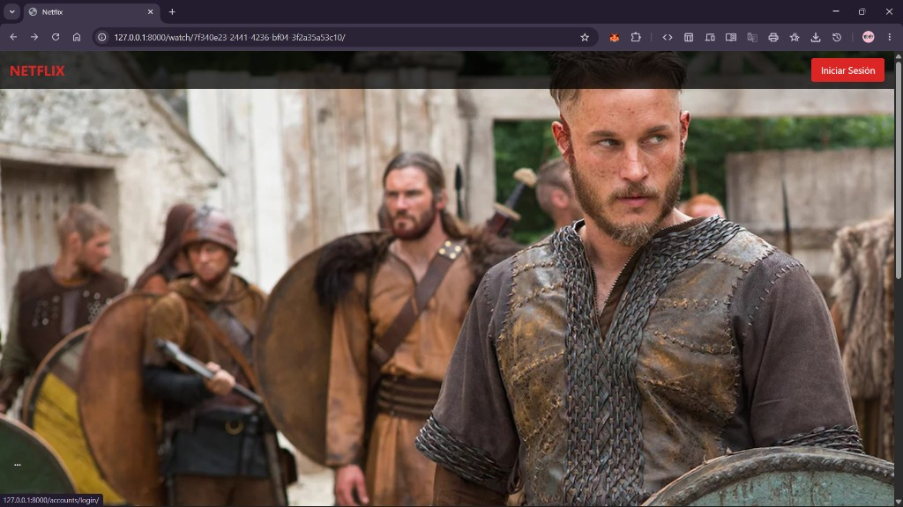
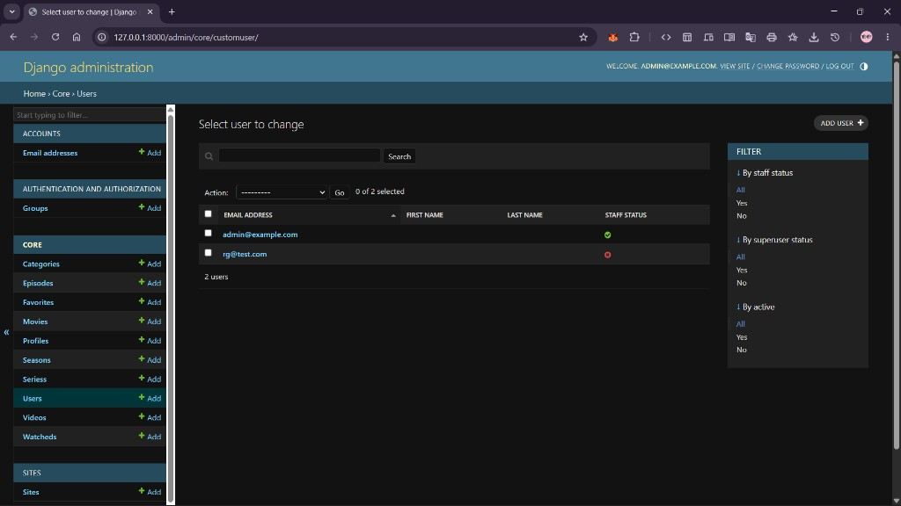

# 🎬 Netflix Clone

> Un clon de Netflix construido con **Django**: una plataforma de streaming que permite a los usuarios registrarse, iniciar sesión, gestionar perfiles y explorar películas y series.

<p align="left">
  
  
  
  
</p>

---

## 📑 Tabla de contenidos

- [Descripción](#-descripción)
- [Capturas](#-capturas)
- [Características](#-características)
- [Stack tecnológico](#-stack-tecnológico)
- [Esquema de la base de datos](#-esquema-de-la-base-de-datos)
- [Analíticas](#-analíticas)
- [Instalación](#-instalación)
- [Panel de administración](#-panel-de-administración)
- [Notas adicionales](#-notas-adicionales)

---

## 📖 Descripción

Este proyecto recrea la funcionalidad básica de Netflix, centrándose en la **simplicidad, la claridad y la intuición**. Los usuarios pueden registrarse, iniciar sesión, crear perfiles (incluyendo perfiles infantiles) y navegar por un catálogo de películas y series organizado por categorías.

Incluye además un **sistema de control parental**: mediante el campo `age_limit` de los modelos, se restringe el acceso a contenido según la clasificación de edad, de modo que los perfiles infantiles solo ven contenido apto.

---

## 🖼️ Capturas

| Inicio de sesión | Selección de perfil |
| :---: | :---: |
|  |  |

| Navegación de contenido | Panel de administración |
| :---: | :---: |
|  |  |

---

## ✨ Características

- 🔐 Registro e inicio de sesión por **email** (con `django-allauth`).
- 👤 Gestión de **perfiles** por usuario (estilo "¿Quién está viendo?").
- 🎞️ Catálogo de **películas y series** con categorías, portadas y clasificación de edad.
- 🧒 **Control parental** basado en la edad (`age_limit`).
- ⭐ Listas de **favoritos** y contenido **visto**.
- 🔎 **Búsqueda** por título y categoría.
- 📊 **Analíticas** de tiempo de visualización con Plotly / Matplotlib.
- 🛠️ **Panel de administración** de Django para gestionar todo el contenido.

---

## 🧰 Stack tecnológico

**Front-end**
- HTML / CSS / JavaScript
- Tailwind CSS
- Django Templates

**Back-end**
- Python
- Django 4.2
- SQLite (por defecto)

**Librerías destacadas**
- `django-allauth` — autenticación
- `django-autoslug` — generación de slugs
- `pandas`, `matplotlib`, `plotly` — analíticas
- `pillow` — manejo de imágenes

---

## 🗄️ Esquema de la base de datos

Las tablas principales son `core_category`, `core_movie` y `core_series`.

### `core_category`

| Campo | Tipo | Notas |
| --- | --- | --- |
| `id` | int | Clave primaria |
| `name` | varchar(100) | No nulo |
| `description` | text | |
| `slug` | varchar(50) | No nulo, único |

### `core_movie`

| Campo | Tipo | Notas |
| --- | --- | --- |
| `id` | int | Clave primaria |
| `title` | varchar(225) | No nulo |
| `description` | text | No nulo |
| `created` | datetime | No nulo |
| `uuid` | char(32) | No nulo, único |
| `type` | varchar(15) | No nulo |
| `flyer` | varchar(100) | |
| `age_limit` | varchar(5) | Control parental |
| `duration` | int (sin signo) | No nulo |
| `cover_image` | varchar(100) | No nulo |
| `category_id` | int | FK → `core_category.id` |
| `slug` | varchar(50) | No nulo, único |

### `core_series`

| Campo | Tipo | Notas |
| --- | --- | --- |
| `id` | int | Clave primaria |
| `title` | varchar(200) | No nulo |
| `num_seasons` | int | No nulo, por defecto 3 |
| `num_episodes` | int | No nulo, por defecto 8 |
| `episode_duration` | int | No nulo, por defecto 60 |
| `description` | text | No nulo |
| `created` | datetime | No nulo |
| `uuid` | UUID | No nulo, único |
| `type` | varchar(10) | No nulo |
| `flyer` | varchar(100) | |
| `age_limit` | varchar(5) | Control parental |
| `cover_image` | varchar(100) | |
| `category_id` | int | FK → `core_category.id` |

> El modelo `Movie` representa una película con su título, descripción, fecha de creación, identificador único (UUID), tipo, clasificación de edad, duración, portada y categoría. La `category` es una clave foránea hacia el modelo `Category`.

---

## 📊 Analíticas

El módulo `core/analytics.py` genera gráficos del tiempo total que los usuarios dedican a ver películas y series, mediante tres funciones principales:

- **`get_watched_data()`** — recupera de la base de datos los datos de películas y series vistas y los carga en un *DataFrame* de pandas.
- **`calculate_total_duration()`** — calcula la duración total vista por cada usuario.
- **`plot_total_duration()`** — genera un gráfico de barras con esos datos.

La vista `analytics_view()` usa **Plotly** para renderizar el gráfico como HTML en la plantilla, y `admin_analytics()` muestra esos mismos gráficos para que el administrador compare los datos entre usuarios.

---

## ⚙️ Instalación

### Requisitos previos
- Python 3.8 o superior
- Pip (gestor de paquetes de Python)
- Git (opcional)

### Pasos

**1. Clona el repositorio**
```bash
git clone <url-del-repositorio>
cd NetflixClone
```

**2. Crea y activa un entorno virtual**

En Windows (PowerShell):
```powershell
python -m venv venv
venv\Scripts\Activate.ps1
```

En Linux / macOS:
```bash
python3 -m venv venv
source venv/bin/activate
```

**3. Instala las dependencias**
```bash
pip install -r requirements.txt
```

**4. Aplica las migraciones (crea las tablas)**
```bash
python manage.py migrate
```

**5. Crea un superusuario** (el login es por email)
```bash
python manage.py createsuperuser --email tucorreo@correo.com
```

**6. Ejecuta el servidor de desarrollo**
```bash
python manage.py runserver
```

**7. Abre el navegador** en [http://localhost:8000](http://localhost:8000)

### Usar otra base de datos (opcional)

Por defecto se usa SQLite. Para usar, por ejemplo, MySQL, edita `DATABASES` en `netflix_clone/settings.py`:

```python
DATABASES = {
    'default': {
        'ENGINE': 'django.db.backends.mysql',
        'NAME': 'nombre_base_datos',
        'USER': 'usuario_base_datos',
        'PASSWORD': 'contraseña_base_datos',
        'HOST': '127.0.0.1',
        'PORT': '3306',
    }
}
```
> Si usas una base de datos distinta a SQLite, instala el controlador correspondiente (por ejemplo, para MySQL: `pip install mysqlclient`).

---

## 🔑 Panel de administración

- Disponible en [http://localhost:8000/admin](http://localhost:8000/admin).
- Se accede con las credenciales del superusuario creado en la instalación.
- Permite gestionar usuarios, perfiles, categorías, películas, series, temporadas y episodios.

---

## 📝 Notas adicionales

- Tras modificar los modelos, actualiza la base de datos con:
  ```bash
  python manage.py makemigrations
  python manage.py migrate
  ```
- La autenticación se realiza con el **email** como identificador (no con nombre de usuario).
